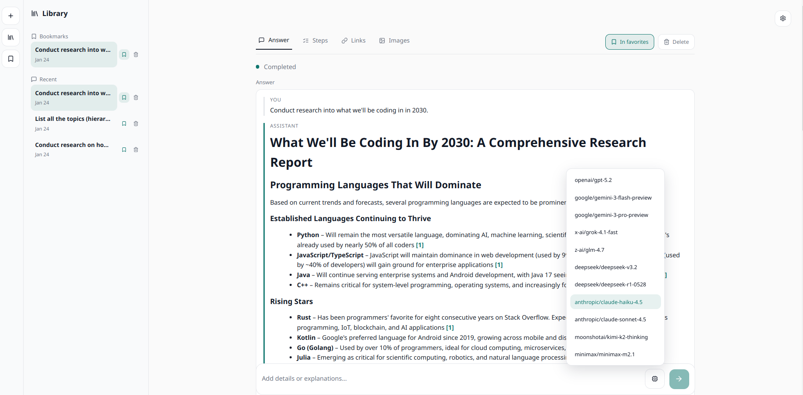
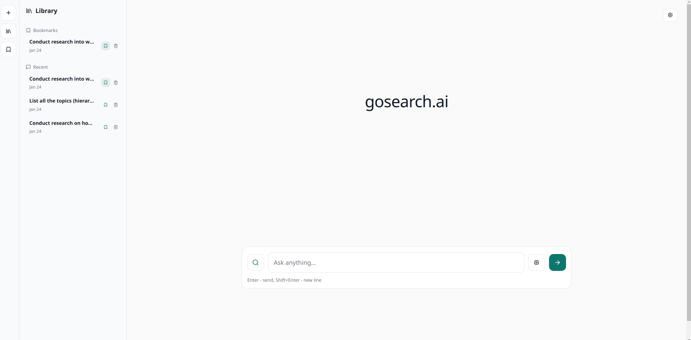

# gosearch-ai

Gosearch-ai is a Perplexity-style research assistant. It combines a Go backend (SSE + agent pipeline), a Vue 3 frontend, SearxNG search or Serper API, and Postgres storage. The stack runs locally via Docker Compose.





## Run (Docker)

1) Copy env file:

```bash
cp docker/.env.example docker/.env
```

2) Set secrets in `docker/.env`:

- `OPENROUTER_API_KEY`
- (optional) `SERPER_API_KEY` if using Serper (`SEARCH_PROVIDER=serper`)

3) Configure models in `docker/config.yaml`:

```yaml
openrouter:
  models:
    - anthropic/claude-haiku-4.5
```

4) Start the stack:

```bash
cd docker
docker compose up --build
```

Ports:
- Frontend: http://localhost:3000
- Backend: http://localhost:8084 (`/healthz`)
- SearxNG: http://localhost:8083
- Postgres: localhost:5434

## Development

Frontend:

```bash
cd frontend
bun install
bun run dev
```

Backend:

```bash
cd backend
go run ./cmd/api
```

## Build

Frontend:

```bash
cd frontend
bun run build
```

## License

MIT

